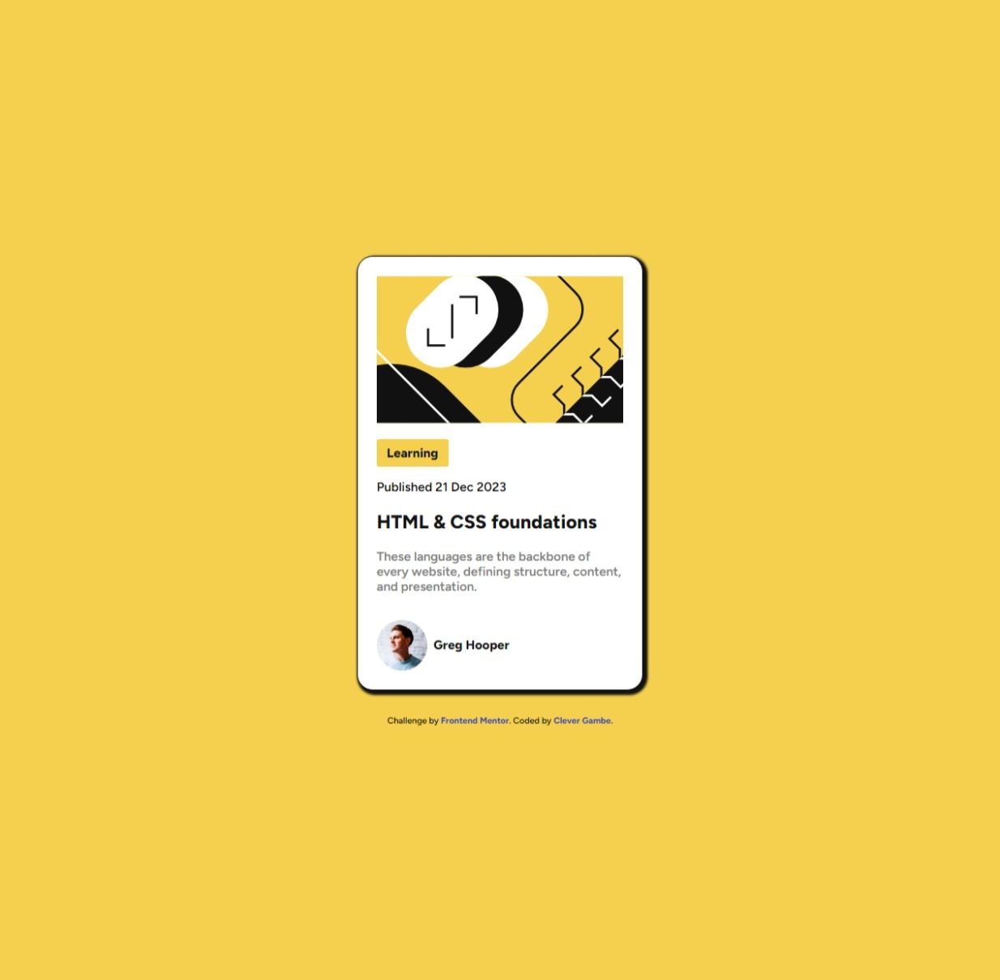

# Frontend Mentor - Blog preview card solution

This is a solution to the [Blog preview card challenge on Frontend Mentor](https://www.frontendmentor.io/challenges/blog-preview-card-ckPaj01IcS). Frontend Mentor challenges help you improve your coding skills by building realistic projects. 

## Table of contents

- [Overview](#overview)
  - [The challenge](#the-challenge)
  - [Screenshot](#screenshot)
  - [Links](#links)
- [My process](#my-process)
  - [Built with](#built-with)
  - [What I learned](#what-i-learned)
  - [Continued development](#continued-development)
- [Author](#author)

## Overview

### The challenge

Users should be able to:

- See hover and focus states for all interactive elements on the page

### Screenshot

### Links

- Solution URL: https://github.com/cgambe/blog-preview-card-main
- Live Site URL: https://cgambe.github.io/blog-preview-card-main

## My process

### Built with

- Semantic HTML5 markup
- CSS custom properties
- Flexbox
- Mobile-first workflow
- Included SVGs

### What I learned
- The fonts beautify the user interface. It was a great experience exploring the Fig Tree font from Google Fonts.
- I also started using Git for desktop which is now making it easier to deploy my projects.
- I also learned to use HTML5 semantic tags which makes it easier for machines the code and understand it.

## Author

- Frontend Mentor - https://www.frontendmentor.io/profile/cgambe

